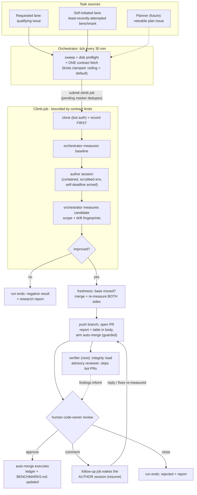
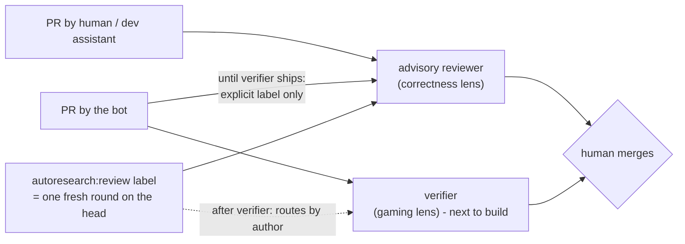

# Roles and flow

**Status: living reference (v1, 2026-08-09). One page answering "who does
what, who may never do what, and how work flows between them." Details live
in architecture.md (mechanics), scaling.md (planner/steward/verifier
design), meta.md (benchmarking the loop itself), and public-surface.md
(threat model).**

## The cast

Two kinds of actor share this system. **Code roles** are deterministic
programs — they enforce; they cannot be argued with. **Model roles** are LLM
sessions or calls — they propose, implement, and critique; nothing they
assert is trusted without a code role or a human behind it. Identity is
data, not accounts: every commit is authored by the one bot account with an
`Agent:` trailer naming the agent id.

| Role | Kind | Status | Does | May never |
|---|---|---|---|---|
| **Maintainer** (human) | — | live | Merge authority on every code PR; writes contracts and `vision:`; owns budgets and credentials | be replaced by anything below |
| **Orchestrator** (tick + sweep + climb glue) | code | live | Schedules everything; measures every baseline/candidate itself; enforces scope, drift, budgets, freshness; ends every run in a report; writes the ledger | trust a session's claim; merge; execute non-bot-authored code |
| **Author session** ("climber") | model | live | One hypothesis per run: reads the brief, edits inside the contract's scope, self-validates, writes the research report | touch the ruler (frozen evals/tests), the contract, progress files; see the PAT; publish anything itself |
| **Follow-up responder** | model | live | The *same* author session resumed when a qualifying human comments on its open PR: replies with evidence, pushes fixes (re-measured by the orchestrator) | anything the author couldn't; resurrect an ended run |
| **Advisory reviewer** | model | live | Adversarial *correctness* review of human/dev PRs; findings-only, sanitized, never an approval | review bot PRs automatically (echo-chamber guard); block CI; approve |
| **Verifier** | model | next to build | Adversarial *integrity* review of bot PRs: hunts gaming (harness exploits, ruler-fishing, leakage, unsupported claims) with contract + eval code + numbers + report in context; "silence is not endorsement" header | approve; block; review human PRs |
| **Planner** | model | designed (scaling.md pt 1) | Owns a target's search *program*: reads leader/lessons/reports, emits vetoable plan issues motivated twice (hypothesis + economics) | enact plans (humans/veto-window do); write `vision:` |
| **Steward** | model | designed (meta.md) | Keeps benchmarks discriminating: restores headroom, proves solvability, sets noise floors — via vetoable plan issues and human-merged env PRs | share identity/credentials/budget with any solver; be scored on solver metrics |
| **Watchdog** | code | designed | Off-cluster heartbeat monitor: alerts when the tick chain goes quiet | act on the cluster |

Authority in one line: **model roles propose, code roles enforce, humans
decide.** Every merge into a target repo is a human decision (bot PRs arm
auto-merge only where branch protection requires that human review — the
arming guard refuses otherwise, in code).

## The main flow: one improvement, end to end

Every terminal path — merged, rejected, negative result, budget exhausted,
aborted, stuck — produces a run report; requested-lane runs post it back to
their issue. Killed jobs (no signal on some clusters) are ended by the
sweep from Slurm truth, with the self-deadline providing rich endings ahead
of walltime.

## Review routing: which reviewer reads what

Review-until-quiet (CONTRIBUTING) governs development PRs: rounds iterate
until one on the head commit finds nothing new — judged termination, docs
get one round, hard cap 4 then escalate.

## Separation rules (the collusion table)

| Boundary | Enforced by |
|---|---|
| Solver never touches ruler/contract/progress files | scope veto + commit veto + drift fingerprints (code) |
| Numbers come only from the orchestrator | climb_once re-measures; PR body states it; CI re-verifies |
| Reviewer never reviews its own pipeline's PRs automatically | bot-author skip (code) |
| Verifier ≠ author | different role, prompt, key; reads adversarially |
| Steward ≠ solver | separate identity, credentials, budget; scored on discrimination, never solver metrics |
| Goal changes are human acts | `vision:` is agent-unwritable (loader invariant); plan issues are vetoable; contract changes merge only by humans |
| Bot never merges | account permissions + the auto-merge arming guard (code) |

## Where state lives

Run records, leases, pending markers: the state root on the shared FS.
Results: `results/leader.json` + `BENCHMARKS.md` in the target repo
(orchestrator-written only). Research memory: reports per run, distilled
lessons in the private notebook (phase 6). Plans: GitHub issues + notebook
copies. Nothing durable lives in any process.
