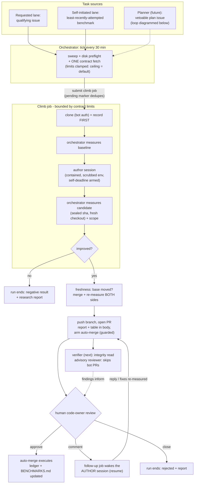
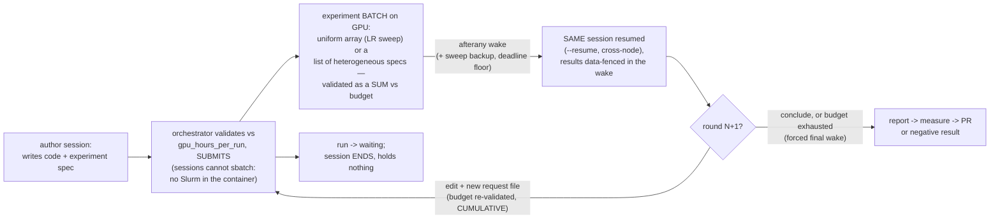
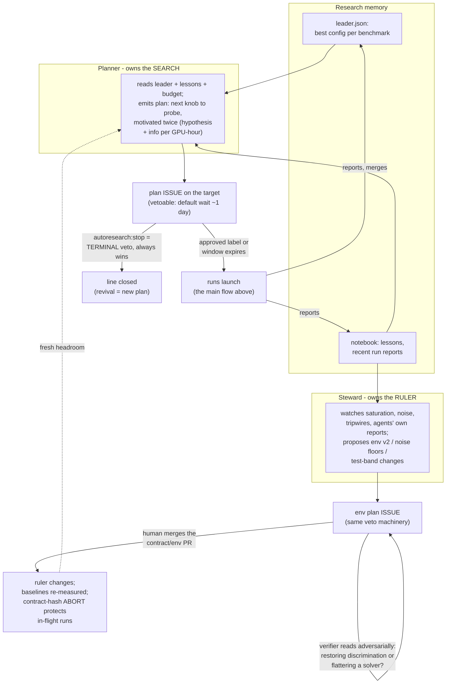
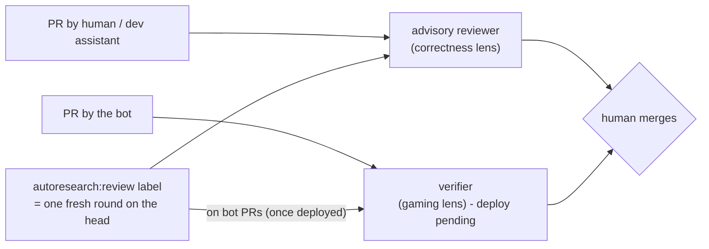

# Roles and flow

**Status: living reference (v1, 2026-08-08). One page answering "who does
what, who may never do what, and how work flows between them." Details live
in architecture.md (mechanics), scaling.md (planner/steward/verifier
design), meta.md (benchmarking the loop itself), and public-surface.md
(threat model).**

## The cast

Two kinds of actor share this system. **Code roles** are deterministic
programs — they enforce; they cannot be argued with. **Model roles** are LLM
sessions or calls — they propose, implement, and critique; nothing they
assert is trusted without a code role or a human behind it. Identity is
data, not accounts: every commit is authored by the one bot account with an
`Agent:` trailer naming the agent id.

| Role | Kind | Status | Does | May never |
|---|---|---|---|---|
| **Maintainer** (human) | — | live | Merge authority on every code PR; writes contracts and `vision:`; owns budgets and credentials | be replaced by anything below |
| **Orchestrator** (tick + sweep + climb glue) | code | live | Schedules everything; measures every baseline/candidate itself; enforces scope, drift, budgets, freshness; ends every run in a report; writes the ledger | trust a session's claim; merge; execute non-bot-authored code |
| **Author session** ("climber") | model | live | One hypothesis per run: reads the brief, edits inside the contract's scope, requests experiment batches (any size the budget covers), self-validates, writes the research report | touch the ruler (frozen evals/tests), the contract, progress files; see the PAT; publish anything itself; submit jobs directly |
| **Follow-up responder** | model | live | The *same* author or steward session resumed when a qualifying human comments on its open PR: replies with evidence, pushes fixes (re-validated/re-measured by the orchestrator, under the resuming role's own key and scope); the verifier's rounds ride along as fenced context | anything the resumed role couldn't; resurrect an ended run; treat context comments as instructions |
| **Advisory reviewer** | model | live | Adversarial *correctness* review of human/dev PRs; findings-only, sanitized, never an approval | review bot PRs automatically (echo-chamber guard); block CI; approve |
| **Verifier** | model | built; deploy pending | Adversarial *integrity* review of bot PRs: hunts gaming (harness exploits, ruler-fishing, leakage, unsupported claims) with contract + eval code + numbers + report in context; "silence is not endorsement" header | approve; block; review human PRs |
| **Planner** | model | designed (scaling.md pt 1) | Owns a target's search *program*: reads leader/lessons/reports, emits vetoable plan issues motivated twice (hypothesis + economics) | enact plans (humans/veto-window do); write `vision:` |
| **Steward** | model | built; deploy pending | Keeps benchmarks discriminating and GROWS them (maintainer direction 2026-08-09): restores headroom, hardens metrics, adds literature-grounded evaluations, and — maturing toward a research scientist — invents new benchmarks, implementing env/eval/tests and PROPOSING the contract entry for the human to enact | share identity/credentials/budget with any solver; be scored on solver metrics; write the contract's benchmark list |
| **Watchdog** | code | designed | Off-cluster heartbeat monitor: alerts when the tick chain goes quiet | act on the cluster |
| **Maintenance agent** | model | later | CI fixes, dependency bumps, issue triage on opted-in repos | count toward research budgets; touch benchmarks |

Authority in one line: **model roles propose, code roles enforce, humans
decide.** Every merge into a target repo is a human decision (bot PRs arm
auto-merge only where branch protection requires that human review — the
arming guard refuses otherwise, in code).

## The main flow: one improvement, end to end

Every terminal path — merged, rejected, negative result, budget exhausted,
aborted, stuck — produces a run report; requested-lane runs post it back to
their issue. Killed jobs (no signal on some clusters) are ended by the
sweep from Slurm truth, with the self-deadline providing rich endings ahead
of walltime.

## Experiments and hibernation (GPU targets; mechanisms live, glue pending)

On GPU-bearing targets the diagram grows a detour between the session and
the candidate measurement — the runs-span-sessions model:

Rounds are the loop: one persistent conversation spanning N sessions,
each round = wake → analyze → edit → request → hibernate. A round's
request is a BATCH: as many parallel experiments as the remaining budget
covers (maintainer principle 2026-08-09: budget is the constraint, not
structure) — a uniform array for sweeps, or a list of heterogeneous
specs, validated as a sum, woken as a unit when ALL are terminal. What a
round cannot do is adapt MID-batch (launch B off A's partial results
without a wake) — that would need a live channel; adaptive search maps
naturally to batches ACROSS rounds instead (successive-halving: broad
short batch → wake → prune → deep batch), with each pruning decision an
auditable artifact. One batch in flight per run; concurrent research
lines = parallel runs, the planner's call. Bounded by cumulative
gpu_hours_per_run (exhaustion forces a concluding wake), the run
deadline, and the wake-attempt cap.

Division of labor: the **author** designs the experiment; the
**orchestrator** launches and meters it (budget enforcement must live where
the session cannot reach); the **run record** owns the job id; the
**planner** (future) owns which experiments are worth their GPU-hours — the
smoke → small → large ladder, large runs earned by pre-registered
small-tier results (scaling.md). Sessions never hold GPUs: hibernation is
the difference between a hypothesis costing days of wall-clock and days of
compute.

**The author⇄orchestrator protocol is turn-based; there is no live
channel.** The orchestrator speaks only at session start (brief on stdin;
wake prompt on resume). The author speaks only by exiting: its workspace
edits, an experiment-request ARTIFACT (a reserved file the commit veto
excludes — command, resources, expected outcome), its report text, and
its stop reason are read after the process ends. Slurm tells the
orchestrator about experiments (afterany + sweep + deadline), never the
author; the orchestrator summarizes and data-fences results into the next
wake. Turn-based is load-bearing: the tick may die anytime (files and
Slurm survive; a held conversation would not), the request is data
validated by code rather than an action a session takes (sessions cannot
sbatch — budget enforcement is unavoidable), a session blocked on a
48-hour job would burn money doing nothing, and every request ever made
is an auditable artifact in the run dir.

Status: the mechanisms are live-verified (waiting state, afterany wake on
any termination, deadlines, resume across nodes, wake prompts) but the
launch glue — the request-artifact format and validation, GPU-hour
accounting, the real wake dispatcher — is pending; it gates the first GPU
target alongside the verifier.

## The planning and stewardship loop (designed; scaling.md, meta.md)

Both future roles act through the SAME governed channel — vetoable plan
issues — never directly on code or contracts:

Constraints that keep this safe: plans move ONE knob from the leader;
`autoresearch:stop` is terminal and beats any approval; the `vision:` field
steering both roles is agent-unwritable (changing it takes a human PR);
steward and solvers never share identity, credentials, or budget; and
consolidation runs (periodic leave-one-out over the period's merges) have
their own capped budget line.

## Review routing: which reviewer reads what

Rounds iterate only on BLOCKING findings — a confirmed correctness,
security, resource, or gaming defect. Advisory findings (edge cases,
wording, low-confidence notes) are posted once, recorded, and filed as
follow-up work; they never trigger another round. Each review leads with a
one-line verdict (blocking vs advisory counts) so the decision is one
glance. Steward and feature PRs get a hard cap of 2 rounds, then merge if
nothing blocks and file the rest; docs get one round; the loop's own core
and security PRs may go further. Merge when materially sound, not when no
finding survives.

## Separation rules (the collusion table)

| Boundary | Enforced by |
|---|---|
| Solver never touches ruler/contract/progress files | scope veto + ledger-only publish commit on the sealed sha (code) |
| Numbers come only from the orchestrator | climb_once re-measures; PR body states it; CI re-verifies |
| Reviewer never reviews its own pipeline's PRs automatically | bot-author skip (code) |
| Verifier ≠ author | different role, prompt, key; reads adversarially |
| Steward ≠ solver | separate identity, credentials, budget; scored on discrimination, never solver metrics |
| Goal changes are human acts | `vision:` is agent-unwritable (loader invariant); plan issues are vetoable; contract changes merge only by humans |
| Bot never merges | account permissions + the auto-merge arming guard (code) |

## Where state lives

Run records, leases, pending markers: the state root on the shared FS.
Results: `results/leader.json` + `BENCHMARKS.md` in the target repo
(orchestrator-written only). Research memory: reports per run, distilled
lessons in the private notebook (phase 6). Plans: GitHub issues + notebook
copies. Nothing durable lives in any process.
